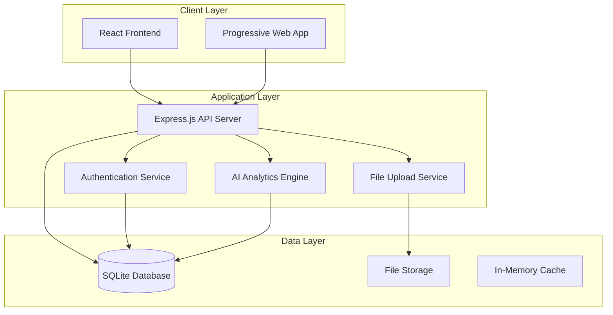
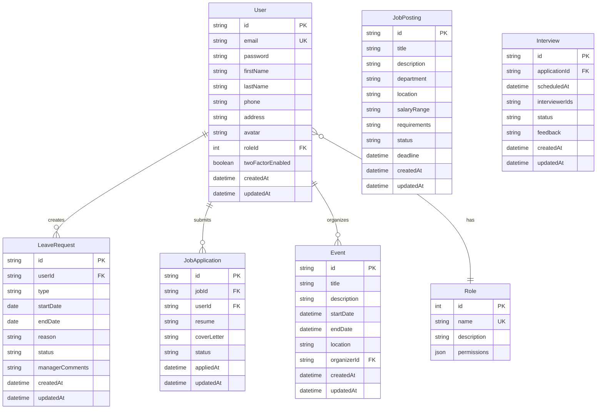
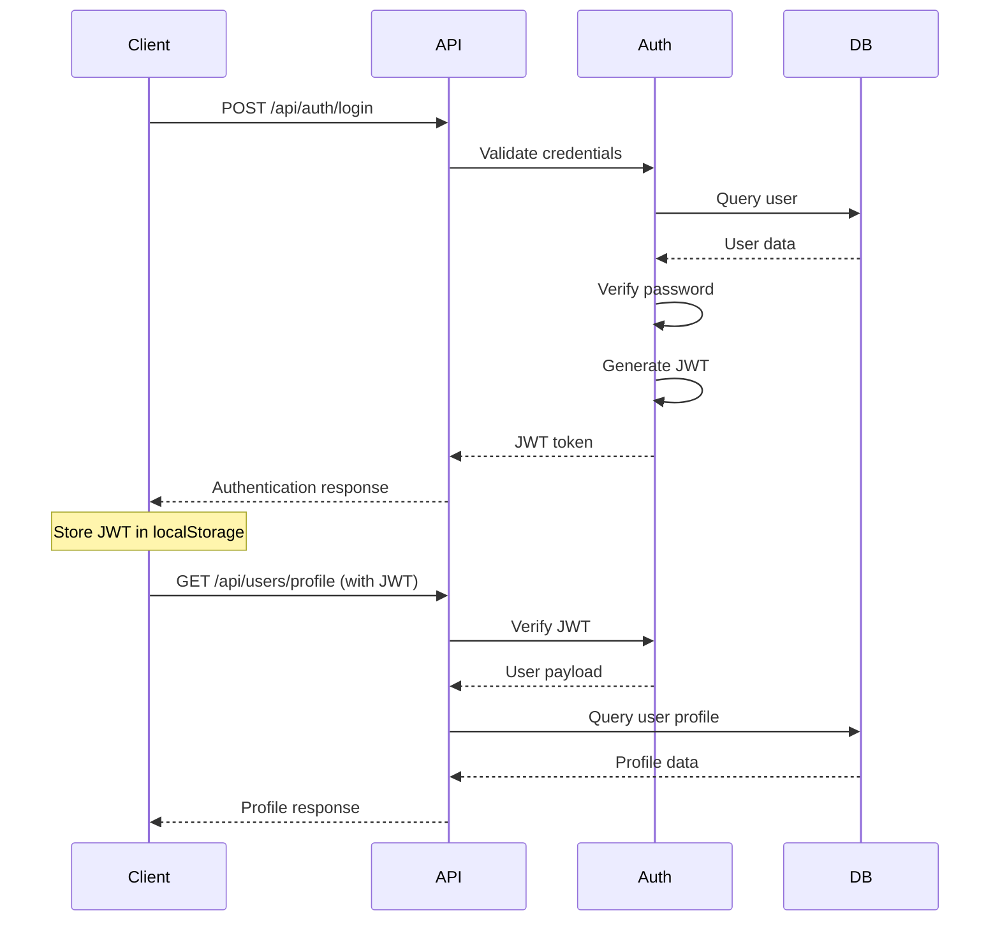
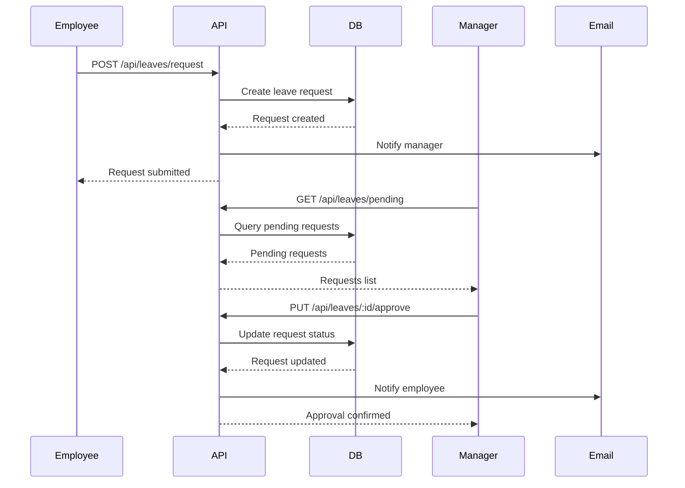
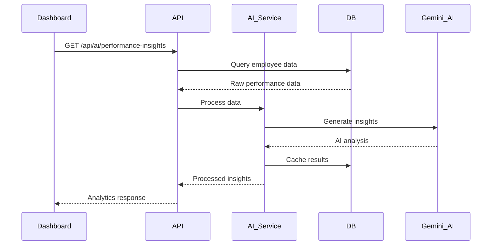
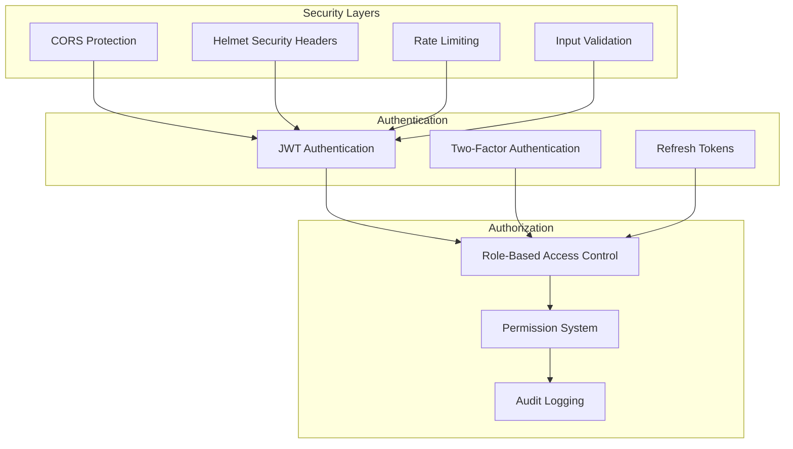
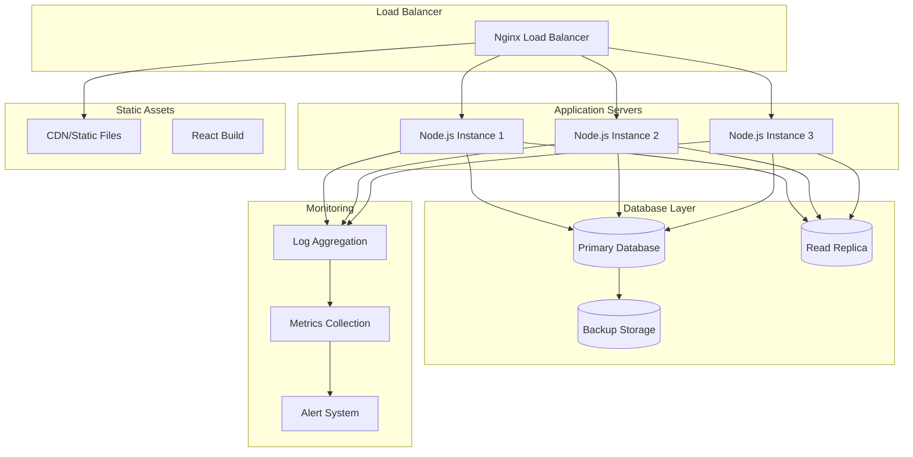
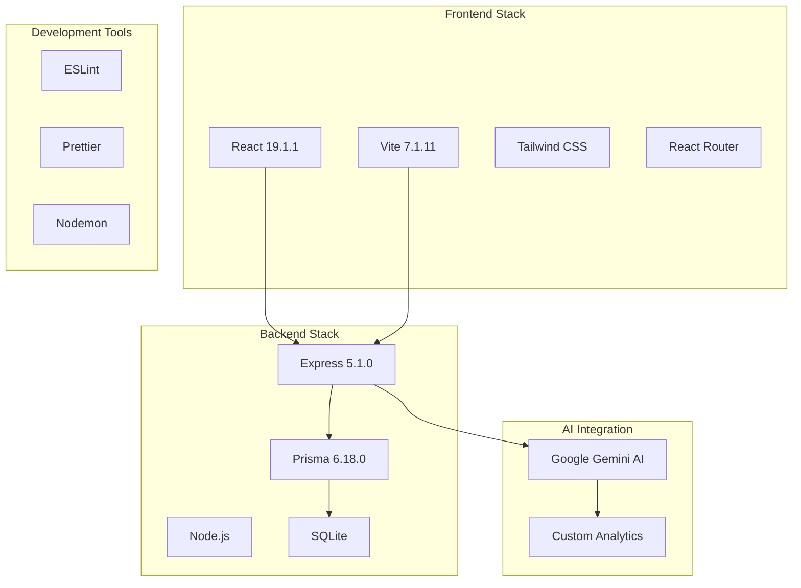

# 🏗️ FWC HRMS Architecture Documentation

## System Overview

The FWC HRMS follows a modern three-tier architecture with clear separation of concerns:



## High-Level Architecture

### Frontend Architecture (React + Vite)

```
HRMS_Frontend/
├── public/                 # Static assets
├── src/
│   ├── components/        # Reusable UI components
│   │   ├── common/       # Generic components (Button, Modal, etc.)
│   │   ├── forms/        # Form-specific components
│   │   └── charts/       # Data visualization components
│   ├── pages/            # Route-based page components
│   │   ├── admin/        # Admin-specific pages
│   │   ├── hr/           # HR-specific pages
│   │   ├── manager/      # Manager-specific pages
│   │   └── employee/     # Employee-specific pages
│   ├── services/         # API service layer
│   │   ├── api.js        # Base API configuration
│   │   ├── authService.js # Authentication services
│   │   └── aiService.js  # AI analytics services
│   ├── contexts/         # React context providers
│   │   ├── AuthContext.jsx
│   │   └── ThemeContext.jsx
│   ├── hooks/            # Custom React hooks
│   ├── utils/            # Helper functions
│   └── styles/           # Global styles and themes
```

### Backend Architecture (Node.js + Express)

```
HRMS_Backend/
├── routes/               # API route definitions
│   ├── authRoutes.js    # Authentication endpoints
│   ├── userRoutes.js    # User management endpoints
│   ├── leaveRoutes.js   # Leave management endpoints
│   ├── jobRoutes.js     # Job posting endpoints
│   └── aiRoutes.js      # AI analytics endpoints
├── controllers/          # Business logic controllers
├── middlewares/         # Custom middleware
│   ├── auth.js          # JWT authentication
│   ├── validation.js    # Input validation
│   └── errorHandler.js  # Error handling
├── prisma/              # Database schema & migrations
│   ├── schema.prisma    # Database schema
│   └── migrations/      # Database migrations
├── utils/               # Backend utilities
└── uploads/             # File upload storage
```

## Database Schema

### Entity Relationship Diagram



## API Architecture

### RESTful API Design

```mermaid
graph LR
    subgraph "Authentication Layer"
        JWT[JWT Middleware]
        RBAC[Role-Based Access Control]
    end
    
    subgraph "API Routes"
        AUTH_R[/api/auth/*]
        USER_R[/api/users/*]
        LEAVE_R[/api/leaves/*]
        JOB_R[/api/jobs/*]
        AI_R[/api/ai/*]
        FILE_R[/api/files/*]
    end
    
    subgraph "Controllers"
        AUTH_C[AuthController]
        USER_C[UserController]
        LEAVE_C[LeaveController]
        JOB_C[JobController]
        AI_C[AIController]
        FILE_C[FileController]
    end
    
    subgraph "Services"
        DB_S[Database Service]
        AI_S[AI Service]
        EMAIL_S[Email Service]
        FILE_S[File Service]
    end
    
    JWT --> AUTH_R
    JWT --> USER_R
    JWT --> LEAVE_R
    JWT --> JOB_R
    JWT --> AI_R
    JWT --> FILE_R
    
    RBAC --> AUTH_R
    RBAC --> USER_R
    RBAC --> LEAVE_R
    RBAC --> JOB_R
    RBAC --> AI_R
    RBAC --> FILE_R
    
    AUTH_R --> AUTH_C
    USER_R --> USER_C
    LEAVE_R --> LEAVE_C
    JOB_R --> JOB_C
    AI_R --> AI_C
    FILE_R --> FILE_C
    
    AUTH_C --> DB_S
    USER_C --> DB_S
    LEAVE_C --> DB_S
    JOB_C --> DB_S
    AI_C --> AI_S
    FILE_C --> FILE_S
    
    AI_C --> DB_S
    AUTH_C --> EMAIL_S
```

## Data Flow Architecture

### Authentication Flow



### Leave Request Flow



### AI Analytics Flow



## Security Architecture

### Authentication & Authorization



## Deployment Architecture

### Production Environment



## Performance Considerations

### Frontend Optimization
- **Code Splitting**: Route-based and component-based splitting
- **Lazy Loading**: Dynamic imports for heavy components
- **Memoization**: React.memo and useMemo for expensive operations
- **Virtual Scrolling**: For large data lists
- **Image Optimization**: WebP format and responsive images

### Backend Optimization
- **Database Indexing**: Optimized queries with proper indexes
- **Caching**: Redis for session and query caching
- **Connection Pooling**: Efficient database connections
- **Compression**: Gzip compression for API responses
- **Rate Limiting**: Prevent API abuse

### Scalability Features
- **Horizontal Scaling**: Multiple application instances
- **Database Sharding**: For large datasets
- **Microservices Ready**: Modular architecture
- **API Versioning**: Backward compatibility
- **Event-Driven Architecture**: Async processing capabilities

## Technology Stack Integration



This architecture ensures:
- **Scalability**: Horizontal and vertical scaling capabilities
- **Maintainability**: Clear separation of concerns
- **Security**: Multiple layers of protection
- **Performance**: Optimized for speed and efficiency
- **Flexibility**: Easy to extend and modify